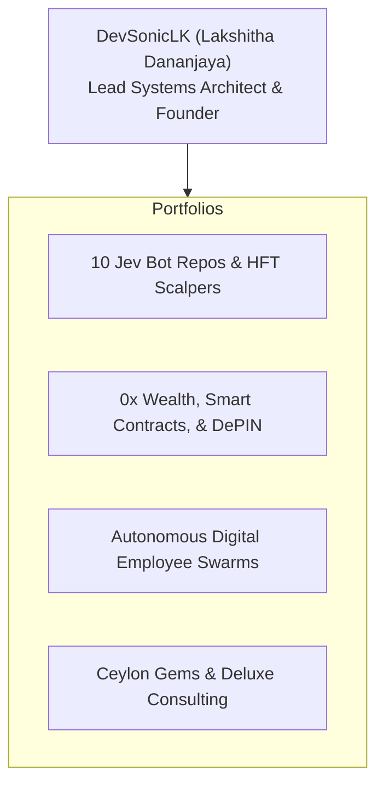
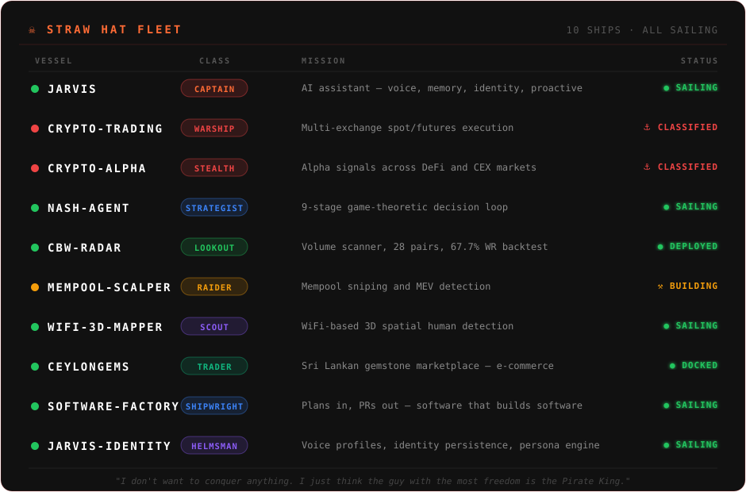
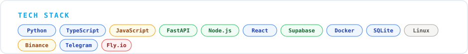

## 🌐 Engineering Ecosystem Architecture

```mermaid
flowchart TD
    Architect["DevSonicLK (Lakshitha Dananjaya)
Lead Systems Architect & Founder"] --> Portfolios["Venture & Codebase Portfolios"]
    
    subgraph Portfolios
        TradingBots["10 Jev Bot Repos & HFT Scalpers"]
        Web3Protocols["0x Wealth, Smart Contracts, & DePIN"]
        DigitalEmployees["Autonomous Digital Employee Swarms"]
        EnterprisePlatforms["Ceylon Gems & Deluxe Consulting"]
    end
```

---

 

 

 

 

 

